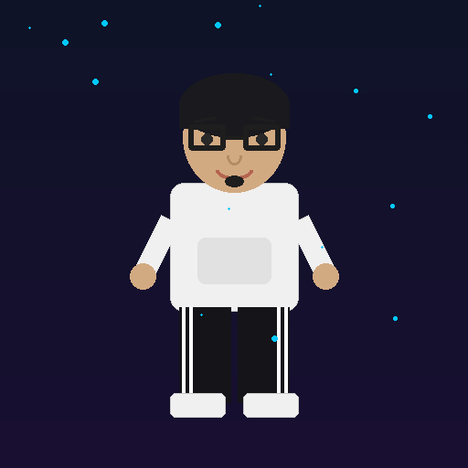
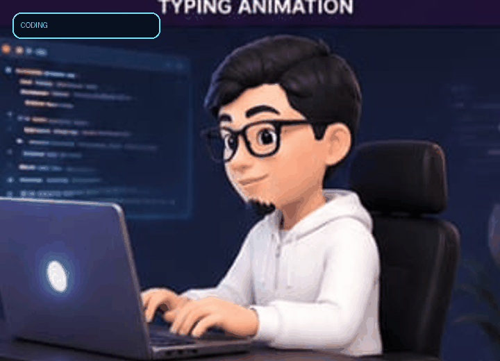
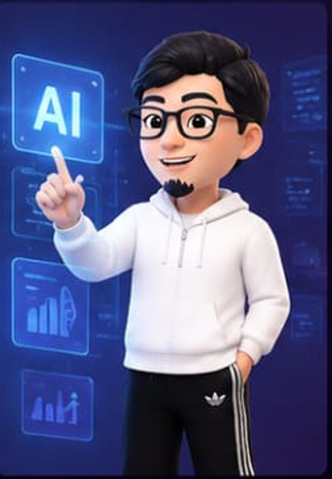
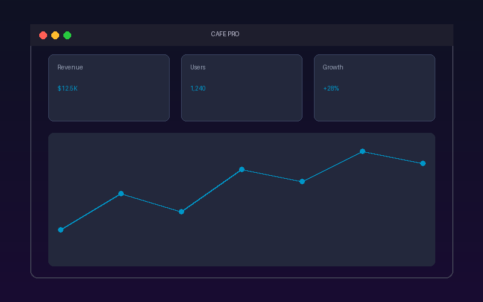
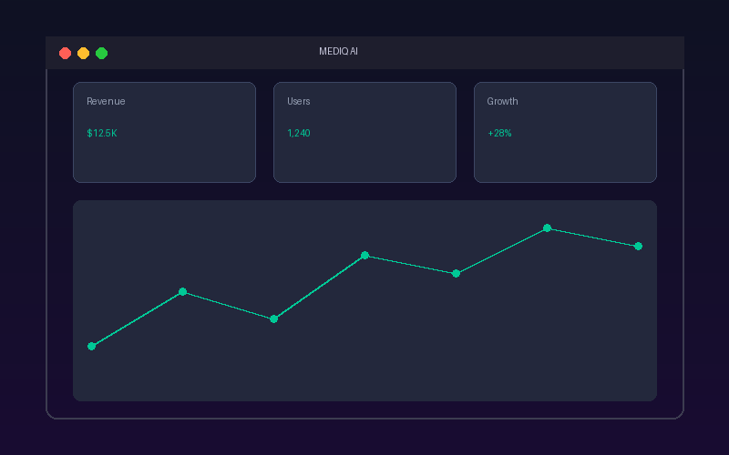
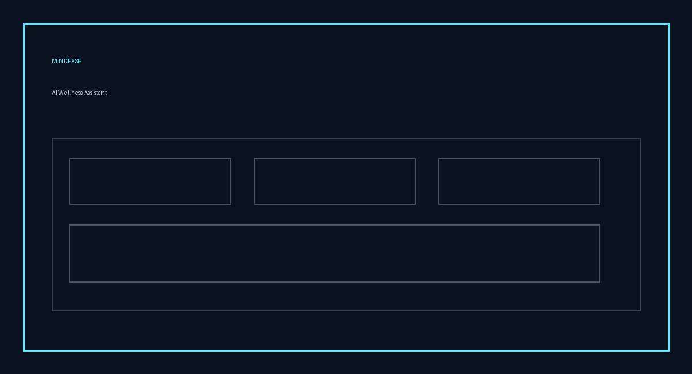
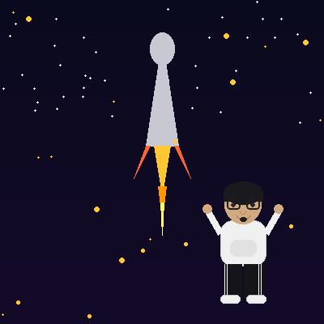

<div align="center">


<br>

# BALACHANDRAN S

### FULL STACK DEVELOPER × AI BUILDER


<br>

<a href="https://im-bala-portfolio.vercel.app">  </a>

<a href="https://www.linkedin.com/in/balas111005">  </a>

<a href="https://github.com/Balachandransakthivel">  </a>

</div>

<div align="center">



## WHO AM I?

I'm Balachandran 👋

**Final Year B.E. Computer Science & Engineering Student**
**Excel Engineering College (Autonomous)**

I build modern web applications and AI-powered solutions
that solve real-world problems.

</div>

<br>

```
┌────────────────────────────────────────────────────────────┐
│                                                            │
│   THINK        DESIGN        BUILD        IMPROVE          │
│      ↓            ↓            ↓             ↓             │
│                                                            │
│     IDEA  ──────►  PRODUCT  ──────►  IMPACT 🚀             │
│                                                            │
└────────────────────────────────────────────────────────────┘
```

---

## 01 — MY DIGITAL WORLD

<div align="center">



<br>

| Category | Technologies |
|----------|-------------|
| ⚛️ **FRONTEND** | React · Next.js · TypeScript · Tailwind CSS |
| ⚙️ **BACKEND** | Node.js · Express.js · REST APIs |
| 🤖 **AI** | AI APIs · AI Integration · Prediction · Automation |
| 🗄️ **DATABASE** | MongoDB · PostgreSQL · MySQL · Supabase |
| ☁️ **CLOUD** | Vercel · Netlify · Supabase · GitHub |

</div>

---

## 02 — CURRENTLY BUILDING

<div align="center">



### 🤖 AI × SOFTWARE

I'm exploring how Artificial Intelligence can become
a practical part of everyday software.

</div>

```
             USER
               │
               ▼
        ┌──────────────┐
        │   WEB APP    │
        └──────┬───────┘
               │
               ▼
        ┌──────────────┐
        │  AI ENGINE   │
        └──────┬───────┘
               │
       ┌───────┼────────┐
       ▼       ▼        ▼
   Prediction  AI      Automation
               │
               ▼
        Better Experience
```

**Areas I'm exploring:**
- 🧠 Intelligent applications
- 💬 AI assistants
- 📊 Prediction systems
- 🎯 Recommendation systems
- ⚡ AI automation
- 🔌 AI API integration

---

## 03 — SELECTED WORK

<div align="center">



### 🍽️ CAFE PRO
**Smart Cafe Billing & Management Platform**

</div>

A modern restaurant management platform designed to simplify
billing, ordering, inventory and business analytics.

**What it does:** Smart Billing · QR Ordering · Inventory · Analytics · Authentication · Menu Management · Order Tracking

**Built with:** React · TypeScript · Tailwind CSS · Supabase · Vite

---

<div align="center">


### 🧠 LEVELUP AI
**Personalized AI Learning Platform**

</div>

An AI-powered learning platform designed to provide
personalized learning experiences.

```
USER
 ↓
SKILL ANALYSIS
 ↓
AI RECOMMENDATION
 ↓
PERSONALIZED LEARNING
 ↓
PROGRESS TRACKING
 ↓
SKILL IMPROVEMENT 🚀
```

**Built with:** React · TypeScript · AI APIs · Tailwind CSS

---

<div align="center">



### 🏥 MEDIQ AI
**Intelligent Hospital Queue & Resource Management**

</div>

An AI-powered hospital management solution focused on
patient flow and resource optimization.

**AI capabilities:**
- ⏱️ Waiting Time Prediction
- 👨‍⚕️ Doctor Schedule Optimization
- 🚨 Emergency Prioritization
- 🛏️ Bed Availability Prediction
- 💊 Medicine Stock Forecasting
- 📊 Hospital Analytics

**Built with:** React · Node.js · AI · MongoDB

---

<div align="center">



### ❤️ MINDEASE
**AI Wellness Assistant**

</div>

A conversational AI application designed around
supportive interactions and personal wellness tracking.

**Features:** AI Conversations · Wellness Tracking · Personalized Interaction · Progress Monitoring

**Built with:** React · Node.js · AI · MongoDB

---

## 04 — TECH UNIVERSE

<div align="center">


<br><br>


<br><br>


<br><br>


</div>

---

## 05 — HOW I BUILD

<div align="center">


```
        💡 IDEA
           │
           ▼
       🔍 RESEARCH
           │
           ▼
       🎨 DESIGN
           │
           ▼
       💻 DEVELOP
           │
           ▼
       🧪 TEST
           │
           ▼
       ⚡ IMPROVE
           │
           ▼
       🚀 DEPLOY
           │
           ▼
       🌍 IMPACT
```

</div>

---

## 06 — GITHUB

<div align="center">


<br><br>


</div>

---

## 07 — CONTRIBUTION MODE

<div align="center">



### CODE → COMMIT → CREATE → REPEAT

<br>


</div>

---

## 08 — DEVELOPER JOURNEY

<div align="center">

```
              2021
                │
                ▼
        🌱 STARTED CODING
                │
                ▼
              2022
                │
                ▼
        🌐 WEB DEVELOPMENT
                │
                ▼
              2023
                │
                ▼
       ⚛️ REACT + FULL STACK
                │
                ▼
              2024
                │
                ▼
          🤖 AI EXPLORATION
                │
                ▼
              2025
                │
                ▼
       🚀 REAL WORLD PROJECTS
                │
                ▼
              2026
                │
                ▼
       🎓 FINAL YEAR CSE
                │
                ▼
        💼 SOFTWARE ENGINEER
```

</div>

---

## 09 — BEYOND CODE

<div align="center">


<br>

🎨 **DESIGN** — Creating clean and modern user interfaces.

🧠 **PROBLEM SOLVING** — Breaking complex problems into simple solutions.

🤖 **INNOVATION** — Exploring AI and emerging technologies.

📚 **LEARNING** — Constantly improving my technical skills.

🚀 **BUILDING** — Turning ideas into real products.

</div>

---

## 10 — WHAT'S NEXT?

<div align="center">

### CURRENT MISSION

```
BUILD + LEARN + EXPERIMENT + CREATE = GROW 🚀
```

<br>

### 🎯 2026 GOALS

- Build impactful software
- Master Full Stack Development
- Explore Advanced AI
- Contribute to Open Source
- Become a Software Engineer

</div>

---

## 11 — LET'S BUILD SOMETHING

<div align="center">


<br>

### HAVE AN IDEA?
### LET'S TURN IT INTO A PRODUCT. 🚀

<br>

<a href="https://im-bala-portfolio.vercel.app">  </a>

<a href="https://www.linkedin.com/in/balas111005">  </a>

<a href="mailto:balas111005@gmail.com">  </a>

<br><br>

<a href="https://drive.google.com/file/d/1z3Tc1QnWLP6F_Qq5nQsXwVqwNy1r8iEZ/view">  </a>

</div>

<div align="center">


<br><br>

### BUILDING TODAY. ENGINEERING TOMORROW.

<br>


</div>
